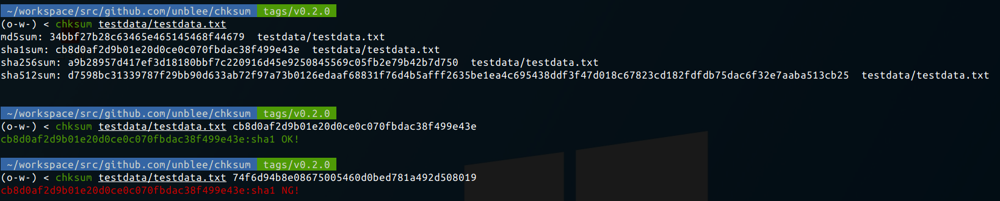

# chksum

## Description

A small tool for checking/generating md5/sha1/sha256/sha512 checksums of a file

## Installation

### Precompiled binary

Precompiled binaries for Windows, macOS, Linux are available at [Releases](https://github.com/unblee/chksum/releases).

### From source

```console
$ go get github.com/unblee/chksum.git
```

## Usage

```
A small tool for checking md5/sha1/sha256/sha512 checksums of a file.
Usage:
  chksum <file> <checksum>
  chksum <file>
  chksum (-h | --help)
Options:
  -h --help     Show this message.
  -V --version  Show version.
```

## Screenshot



## Contribution

1.  Fork(https://github.com/unblee/chksum/fork)
2.  Create a branch (`git checkout -b my-fix`)
3.  Commit your changes (`git commit -am "fix something"`)
4.  Push to the branch (`git push origin my-fix`)
5.  Create a new [Pull Request](https://github.com/unblee/chksum/pulls)
6.  Have a coffee break and wait

## Author

[unblee](https://github.com/unblee)

## License

[](https://github.com/unblee/chksum/blob/master/LICENSE)
